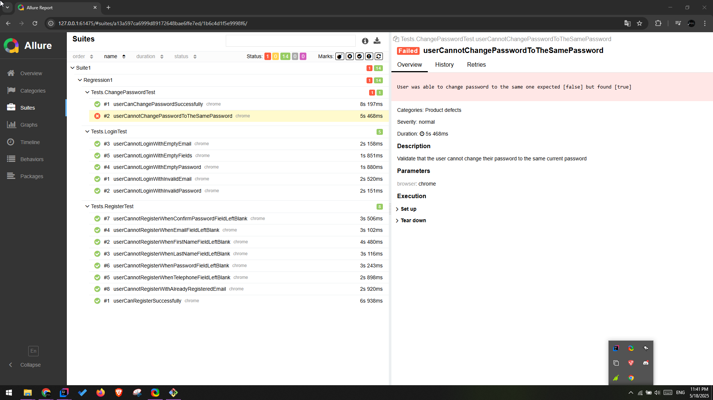
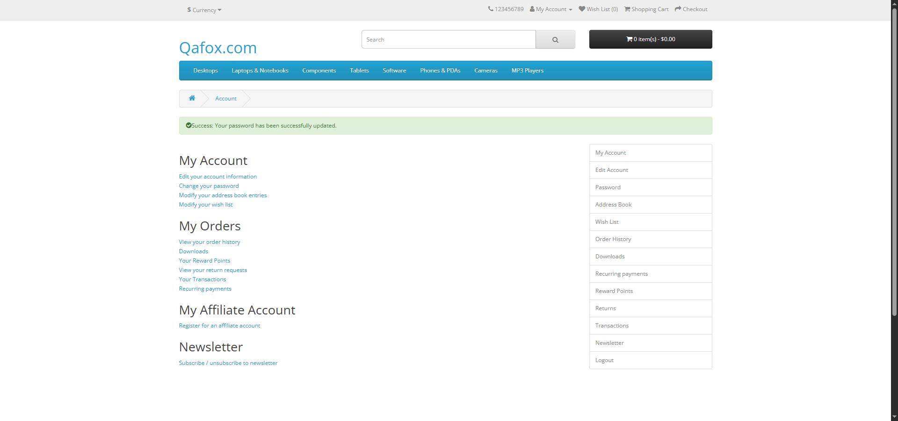

# 💻 QaFox Automation Project

✅ This is a test automation demo project that tests an eCommerce demo site called: [QAFox](https://tutorialsninja.com/demo/index.php?route=common/home)

The test scripts cover:
- User registration and login
- Change password functionality
- Adding and removing items from the shopping cart

## 📖 Overview

This repository contains a robust and scalable automated testing project built with **Java**, **TestNG**, **Selenium WebDriver**, and **Allure Reports**.  
The project follows the **Page Object Model (POM)** design pattern to ensure modularity, reusability, and maintainability.

<p>
  
</p>

## 📑 Technologies & Skill & Features
| Technologies      | Description |
| ----------- | ----------- |
| **Java:**      | The project is developed using Java, providing a robust and widely used programming language for automation.       |
| **TestNG:**   | TestNG is used as the testing framework, offering powerful test configuration options, parallel execution, and detailed reporting.        |
| **Selenium WebDriver:**   | The project includes Selenium WebDriver for automating browser interactions        |
| **Page Object Model (POM):**   | The project follows the POM design pattern, enhancing test maintainability and reusability by separating page elements and actions.        |
| **Allure Reports:**   | Test results are documented using Allure Reports, providing a clear and interactive visualization of test execution.        |


## 📊 Reports
  ```bash
  allure serve allure-results
  ```
<p>
  
</p>

## 📊 Reports Examples
<p>
  
</p>

## 🚀 Getting Started

1. **Clone the Repository:**
   ```bash
    git clone https://github.com/Osama-M-Ahmed/QaFox-Project.git
    ```

## 📁 Project Structure
```
src
├── main
│ ├── java
│ │ ├── Pages
│ │ │ ├── ChangePasswordPage.java
│ │ │ ├── HomePage.java
│ │ │ ├── LoginPage.java
│ │ │ ├── PageBase.java
│ │ │ ├── ProductPage.java
│ │ │ └── RegisterPage.java
│ │ └── Utils
│ │ ├── ScreenShot.java
│ │ └── Utils.java
│ └── resources
│ └── Features
│ └── Register.feature
├── test
│ ├── java
│ │ ├── Base
│ │ │ └── TestBase.java
│ │ ├── StepDefs
│ │ │ ├── Hooks.java
│ │ │ └── Register_StepDef.java
│ │ └── Tests
│ │ ├── AddToCartTest.java
│ │ ├── ChangePasswordTest.java
│ │ ├── LoginTest.java
│ │ └── RegisterTest.java
│ └── resources
│ └── Data
│ └── data.properties

```

Thanks for visiting my GitHub profile! 😊
Osama Mohamed


